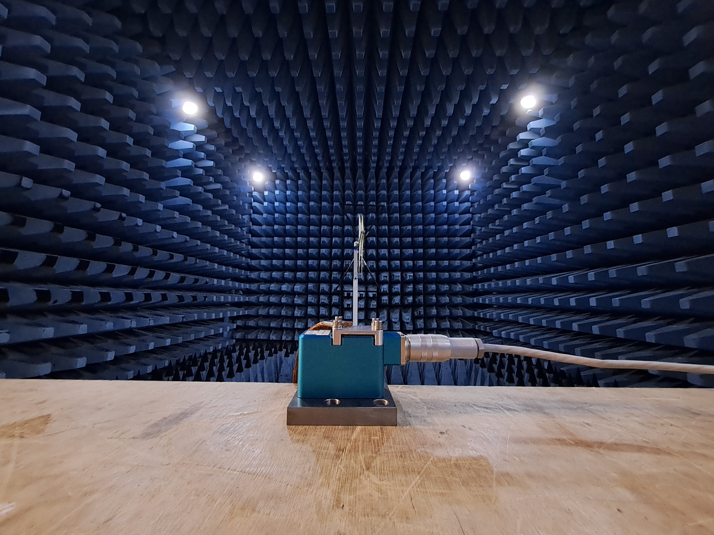

+++
date = '2025-06-19T19:58:45+01:00'
draft = true
title = 'Marine Certification'
+++

Throughout 2023 and into 2024 BLJ91A supported a rapidly growing hydraulics control company in the Bristol region.  With a new product in the pipeline for a marine application, Lloyd's Register type approval was required.  Working on a tight timeline, 

Here are some details about the marine certification work I did at Domin Fluid Power.

